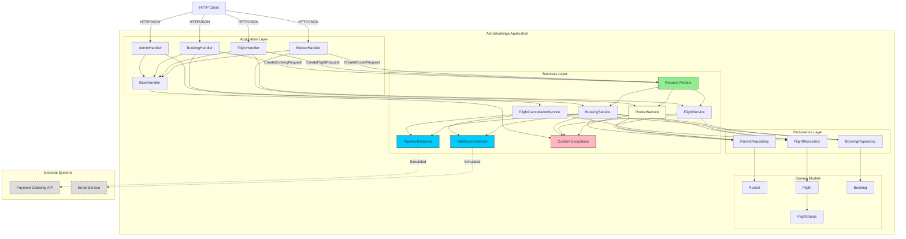

# AstroBookings - Arquitectura

## Introducción

AstroBookings es una aplicación de reservas de viajes espaciales implementada con arquitectura en capas. Utiliza Java 21, JDK HTTP Server y Jackson para JSON. La base de datos es en memoria (HashMap).

**Características principales**:
- Gestión de cohetes, vuelos y reservas
- Control de capacidad y estados de vuelos
- Cancelación automática de vuelos con devoluciones
- Procesamiento de pagos simulado (gateway externo)
- Notificaciones por email simuladas

## Tecnologías

- **Java**: 21
- **Build**: Maven 3.x
- **HTTP Server**: JDK HTTP Server (com.sun.net.httpserver)
- **JSON**: Jackson 2.15.2
- **Database**: In-memory (HashMap)
- **External Services**: Simulated (console logs)

## Endpoints

| Method | Path | Description |
|--------|------|-------------|
| GET | `/rockets` | List all rockets |
| POST | `/rockets` | Create rocket |
| GET | `/flights` | List available flights (filter by status) |
| POST | `/flights` | Create flight |
| GET | `/bookings` | List bookings (filter by flight/passenger) |
| POST | `/bookings` | Create booking (processes payment) |
| POST | `/admin/cancel-flights` | Trigger cancellation check |

## Estructura de Carpetas

```
java/
├── src/main/java/com/astrobookings/
│   ├── app/            # HTTP Handlers (Presentation Layer)
│   │   └── *.Handler   # HTTP request handlers
│   ├── business/       # Services, Models & Exceptions (Business Layer)
│   │   ├── exceptions/ # Custom business exceptions
│   │   ├── models/     # Request models (anemic records)
│   │   ├── *Service.java       # Service Interfaces
│   │   ├── *ServiceImpl.java   # Service Implementations (package-private)
│   │   └── ServiceFactory.java # Factory for Services
│   ├── providers/      # Repositories & Domain Models (Data Layer)
│   │   ├── models/     # Domain entities
│   │   ├── *Repository.java        # Repository Interfaces
│   │   ├── InMemory*Repository.java # Repository Implementations (package-private)
│   │   └── RepositoryFactory.java  # Factory for Repositories
│   └── AstroBookingsApp.java
```

**Capas**:
- **app**: Handlers HTTP para validación de estructura
  - Handlers: Rocket, Flight, Booking, Admin, BaseHandler
  - Validan que los campos requeridos existan antes de pasar a servicios
- **business**: Services + Request Models + Excepciones personalizadas
  - **models/**: Request models anémicos (CreateFlightRequest, CreateBookingRequest, CreateRocketRequest)
  - **Services**: RocketService, FlightService, BookingService, FlightCancellationService
  - **Gateways**: PaymentGateway, NotificationService
  - **Exceptions**: ValidationException, NotFoundException, PaymentException
- **providers**: Repositories + Modelos de dominio
  - Repositories: RocketRepository, FlightRepository, BookingRepository
  - Models: Rocket, Flight, Booking, FlightStatus

## Mejoras de Responsabilidad por Capas

### Separación de Validaciones

**Validación de Estructura (Capa de Aplicación)**:
- Handlers validan que los campos requeridos existan y tengan el tipo correcto
- Ejemplo: `FlightHandler` valida que `rocketId`, `departureDate` y `basePrice` estén presentes
- Los handlers pasan objetos `CreateXxxRequest` completos a los servicios

**Validación de Negocio (Capa de Negocio)**:
- Services validan reglas de negocio y parsean datos
- Ejemplo: `FlightService` valida que la fecha sea futura, no exceda 1 año, y parsea el string a `LocalDateTime`

### Request Models en la Capa de Negocio

Los modelos de entrada están en `business/models` como **Records anémicos**:

```java
public record CreateFlightRequest(String rocketId, String departureDate, Double basePrice) {}
public record CreateBookingRequest(String flightId, String passengerName) {}
public record CreateRocketRequest(String name, Integer capacity, Double speed) {}
```

**Ventajas**:
- **Firmas limpias**: Los servicios reciben un objeto en lugar de múltiples parámetros
- **Reutilización**: Los mismos modelos se pueden usar desde cualquier interfaz (REST, CLI, tests)
- **Encapsulación**: Los servicios no dependen de detalles HTTP
- **Evolución**: Añadir campos no rompe las firmas de métodos

### Excepciones Personalizadas

Reemplazo de excepciones genéricas por excepciones específicas de negocio:

- **ValidationException** (400 Bad Request): Errores de validación de negocio
- **NotFoundException** (404 Not Found): Recursos no encontrados
- **PaymentException** (402 Payment Required): Errores de procesamiento de pago

### Manejo Centralizado de Errores

`BaseHandler.handleBusinessException()` mapea excepciones a códigos HTTP:
- `ValidationException` → 400
- `NotFoundException` → 404
- `PaymentException` → 402
- `IllegalArgumentException` (validación de estructura) → 400
- Otros → 500

### Inversión de Dependencias y Factorías

Se ha implementado un patrón de **Inversión de Dependencias** manual para desacoplar las capas y mejorar la mantenibilidad.

#### 1. Interfaces (Contratos)
Cada componente de negocio y persistencia define su contrato a través de una interfaz pública:
- `BookingService`, `FlightService`, `RocketService`
- `BookingRepository`, `FlightRepository`, `RocketRepository`

#### 2. Implementaciones Ocultas
Las implementaciones concretas son **package-private** (sin modificador de acceso público) para impedir su instanciación directa desde otras capas:
- `BookingServiceImpl`, `InMemoryBookingRepository`, etc.
- Esto obliga a los consumidores a depender únicamente de las interfaces.

#### 3. Factorías Estáticas
Se utilizan factorías para proveer las instancias, actuando como un contenedor de inyección de dependencias simple:

- **`ServiceFactory`**: Punto de acceso único para la capa de Aplicación (`app`).
  ```java
  // En BookingHandler.java
  private BookingService bookingService = ServiceFactory.getBookingService();
  ```

- **`RepositoryFactory`**: Punto de acceso único para la capa de Negocio (`business`).
  ```java
  // En BookingServiceImpl.java
  private BookingRepository bookingRepository = RepositoryFactory.getBookingRepository();
  ```

Este diseño permite:
- **Desacoplamiento**: Las capas superiores no conocen los detalles de implementación de las inferiores.
- **Testabilidad**: Facilita la creación de mocks para tests unitarios (aunque en esta fase usamos implementaciones en memoria).
- **Flexibilidad**: Cambiar de `InMemoryRepository` a `SqlRepository` solo requiere cambiar la factoría, sin tocar los servicios.

## Flujo de Datos

### Crear Reserva (POST /bookings)
```
Application Layer
  └─ BookingHandler
       ├─ Deserializes JSON → CreateBookingRequest
       ├─ Validates structure (fields exist)
       └─ Passes CreateBookingRequest to service
            ↓
          Business Layer
            └─ BookingService.createBooking(CreateBookingRequest)
                 ├─ Validates business rules
                 ├─ PaymentGateway (process payment)
                 └─ NotificationService (if flight confirmed)
                      ↓
                    Persistence Layer
                      ├─ BookingRepository (save booking)
                      └─ FlightRepository (update flight status)
                           ↓
                         Domain Models
                           ├─ Booking (with paymentTransactionId)
                           └─ Flight (status: SCHEDULED → CONFIRMED)
```

### Crear Vuelo (POST /flights)
```
Application Layer
  └─ FlightHandler
       ├─ Deserializes JSON → CreateFlightRequest
       ├─ Validates structure (fields exist)
       └─ Passes CreateFlightRequest to service
            ↓
          Business Layer
            └─ FlightService.createFlight(CreateFlightRequest)
                 ├─ Validates business rules
                 ├─ Parses departureDate string → LocalDateTime
                 └─ Verifies rocket exists
                      ↓
                    Persistence Layer
                      ├─ FlightRepository (save flight)
                      └─ RocketRepository (verify rocket exists)
```

### Crear Cohete (POST /rockets)
```
Application Layer
  └─ RocketHandler
       ├─ Deserializes JSON → CreateRocketRequest
       ├─ Validates structure (fields exist)
       └─ Passes CreateRocketRequest to service
            ↓
          Business Layer
            └─ RocketService.createRocket(CreateRocketRequest)
                 └─ Validates business rules (capacity <= 10)
                      ↓
                    Persistence Layer
                      └─ RocketRepository (save rocket)
```

## Ejecución

```bash
# Compilar
mvn clean package

# Ejecutar
java -jar target/astrobookings-1.0-SNAPSHOT.jar

# Server: http://localhost:8080
```

Ver [README.md](README.md) para instrucciones detalladas.

---

## Diagrama C4 - Nivel 3 (Componentes)



**Leyenda**:
- **Líneas sólidas**: Dependencias directas
- **Líneas punteadas**: Servicios externos simulados
- **Azul**: Gateways a servicios externos
- **Verde**: Request Models (anemic records en business/models)
- **Rosa**: Excepciones personalizadas
- **Amarillo**: RocketService (añadido para eliminar acceso directo a repositorio)
- **Gris**: Servicios externos (no implementados)