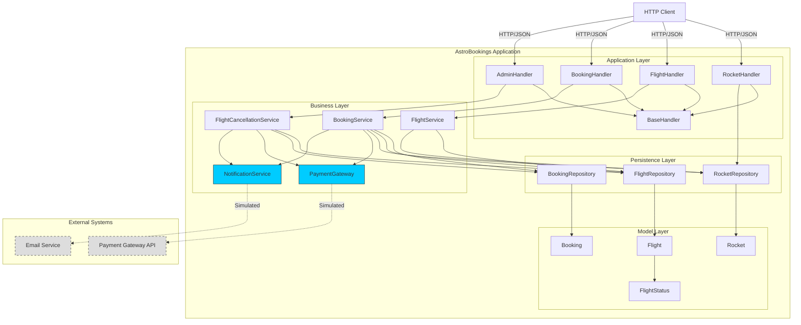

# AstroBookings - Arquitectura

## Introducción

AstroBookings es una aplicación de reservas de viajes espaciales implementada con arquitectura en capas tradicional. Utiliza Java 21, JDK HTTP Server y Jackson para JSON. La base de datos es en memoria (HashMap).

La arquitectura actual es **intencionalmente deficiente** para propósitos educativos, presentando anti-patrones comunes que serán refactorizados durante el taller de arquitectura de software.

**Características principales**:
- Gestión de cohetes, vuelos y reservas
- Control de capacidad y estados de vuelos
- Cancelación automática de vuelos con devoluciones
- Procesamiento de pagos simulado (gateway externo)
- Notificaciones por email simuladas

## Tecnologías

- **Java**: 21
- **Build**: Maven 3.x
- **HTTP Server**: JDK HTTP Server (com.sun.net.httpserver)
- **JSON**: Jackson 2.15.2
- **Database**: In-memory (HashMap)
- **External Services**: Simulated (console logs)


## Endpoints

| Method | Path | Description |
|--------|------|-------------|
| GET | `/rockets` | List all rockets |
| POST | `/rockets` | Create rocket |
| GET | `/flights` | List available flights (filter by status) |
| POST | `/flights` | Create flight |
| GET | `/bookings` | List bookings (filter by flight/passenger) |
| POST | `/bookings` | Create booking (processes payment) |
| POST | `/admin/cancel-flights` | Trigger cancellation check |


## Estructura de Carpetas

```
java/
├── src/main/java/com/astrobookings/
│   ├── app/        # HTTP Handlers (Presentation Layer)
│   ├── business/   # Services & Gateways (Business Layer)
│   ├── database/   # Repositories (Data Access Layer)
│   └── models/     # Domain Models (Anemic)
│
├── pom.xml
├── README.md
└── ARCHITECTURE.md
```

**Capas**:
- **app**: Handlers HTTP (Rocket, Flight, Booking, Admin)
- **business**: Services (Flight, Booking, Cancellation) + Gateways (Payment, Notification)
- **database**: Repositories in-memory (Rocket, Flight, Booking)
- **models**: Entidades (Rocket, Flight, Booking, FlightStatus)

## Flujo de Datos

### Crear Reserva (POST /bookings)
```
Application Layer
  └─ BookingHandler
       ↓
     Business Layer
       └─ BookingService
            ├─ PaymentGateway (process payment)
            └─ NotificationService (if flight confirmed)
                 ↓
               Persistence Layer
                 ├─ BookingRepository (save booking)
                 └─ FlightRepository (update flight status)
                      ↓
                    Model Layer
                      ├─ Booking (with paymentTransactionId)
                      └─ Flight (status: SCHEDULED → CONFIRMED)
```

### Cancelar Vuelos (POST /admin/cancel-flights)
```
Application Layer
  └─ AdminHandler
       ↓
     Business Layer
       └─ FlightCancellationService
            ├─ PaymentGateway (process refunds)
            └─ NotificationService (send cancellation emails)
                 ↓
               Persistence Layer
                 ├─ FlightRepository (find & update to CANCELLED)
                 └─ BookingRepository (get bookings for refunds)
                      ↓
                    Model Layer
                      ├─ Flight (status: SCHEDULED → CANCELLED)
                      └─ Booking (refunded via paymentTransactionId)
```


## Ejecución

```bash
# Compilar
mvn clean package

# Ejecutar
java -jar target/astrobookings-1.0-SNAPSHOT.jar

# Server: http://localhost:8080
```

Ver [README.md](README.md) para instrucciones detalladas.

---

## Diagrama C4 - Nivel 3 (Componentes)



**Leyenda**:
- **Líneas sólidas**: Dependencias directas (acoplamiento fuerte)
- **Líneas punteadas**: Servicios externos simulados
- **Azul**: Gateways a servicios externos
- **Gris**: Servicios externos (no implementados)

---