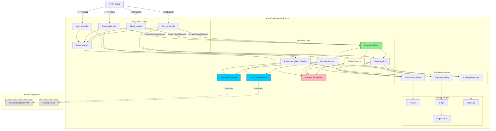

# Diagrama de Componentes (C4 Nivel 3)

**Leyenda**:
- **Líneas sólidas**: Dependencias directas
- **Líneas punteadas**: Servicios externos simulados
- **Azul**: Gateways a servicios externos
- **Verde**: Request Models (anemic records en business/models)
- **Rosa**: Excepciones personalizadas
- **Amarillo**: RocketService (añadido para eliminar acceso directo a repositorio)
- **Gris**: Servicios externos (no implementados)
